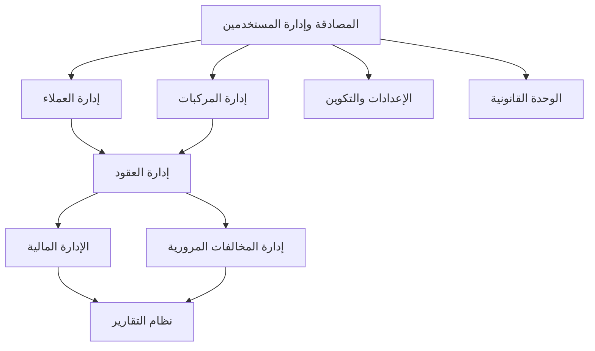

# الدليل الشامل لنظام حلول الإيجار - قطر
# Comprehensive Documentation for Qatar Rental Solutions System

## جدول المحتويات / Table of Contents

### الجزء الأول: إصلاحات وتحسينات النظام
1. [إصلاح مشاكل إمكانية الوصول](#accessibility-fixes)
2. [الميزات المتقدمة لـ RTL](#rtl-features)
3. [تحسينات محرر العقود](#agreement-editor)
4. [إرشادات حقول بيانات العملاء](#customer-data-fields)

### الجزء الثاني: أدلة الاستخدام والتطبيق
5. [دليل إنشاء العقود](#agreement-guide)
6. [تفاصيل صفحة العقود](#agreement-details)
7. [دليل الاختبار اليدوي](#manual-testing)

### الجزء الثالث: خطط التطوير والتنفيذ
8. [خطة استبدال البيانات الوهمية](#mock-data-replacement)
9. [قالب تطبيق الميزات](#feature-implementation)
10. [خطة التنفيذ الشاملة](#implementation-plan)

---

## 1. إصلاح مشاكل إمكانية الوصول {#accessibility-fixes}

### المشكلة التي تم حلها
تم إصلاح تحذيرات React الخاصة بإمكانية الوصول: "Missing Description or aria-describedby={undefined} for DialogContent"

### السبب الجذري
كانت عدة مكونات `DialogContent` تفتقر إلى مكونات `DialogDescription` المطلوبة لدعم إمكانية الوصول المناسبة.

### الملفات التي تم إصلاحها:

#### 1. PaymentHistorySection.tsx ✅
- **الموقع**: `src/components/payments/PaymentHistorySection.tsx`
- **التغيير**: إضافة استيراد و مكون `DialogDescription`
- **الحوار**: حوار تعديل رسوم التأخير
- **الوصف المضاف**: "قم بتحديث مبلغ رسوم التأخير لهذه الدفعة"

#### 2. CustomerFinancialTab.tsx ✅
- **الموقع**: `src/components/customers/CustomerFinancialTab.tsx`
- **التغيير**: إضافة `DialogDescription` لحوارين
- **الحوارات المُصلحة**:
  1. **إرسال تذكير دفع**: "إرسال تذكير للعميل بالدفعات المستحقة"
  2. **سجل الدفعات**: "عرض جميع الدفعات والمعاملات المالية لهذا العميل"

### النمط المطبق:
```tsx
// قبل (يسبب تحذير)
<DialogContent>
  <DialogHeader>
    <DialogTitle>العنوان</DialogTitle>
  </DialogHeader>
</DialogContent>

// بعد (متوافق مع إمكانية الوصول)
<DialogContent>
  <DialogHeader>
    <DialogTitle>العنوان</DialogTitle>
    <DialogDescription>
      نص وصفي يوضح الغرض من الحوار
    </DialogDescription>
  </DialogHeader>
</DialogContent>
```

### التأثير:
- ✅ إزالة تحذيرات React في وحدة تحكم المتصفح
- ✅ تحسين التوافق مع قارئات الشاشة
- ✅ إمكانية وصول أفضل للمستخدمين ذوي الإعاقة
- ✅ اتباع أفضل ممارسات Radix UI
- ✅ الحفاظ على دعم RTL (العربية)

---

## 2. الميزات المتقدمة لـ RTL {#rtl-features}

### نظرة عامة
تطبيق شامل للميزات المتقدمة لـ RTL (الكتابة من اليمين إلى اليسار) مصمم خصيصاً للواجهات العربية، مما يوفر تجربة مستخدم محسنة لمستخدمي السوق القطري.

### 🎬 نظام الرسوم المتحركة المدركة لـ RTL

#### الميزات المُطبقة:

##### ✅ نظام الرسوم المتحركة (`src/utils/rtl-advanced-features.ts`)
- **رسوم متحركة للانزلاق**: اتجاهات انزلاق مدركة لـ RTL (بداية/نهاية بدلاً من يسار/يمين)
- **رسوم متحركة للتلاشي**: تلاشي سلس مع توقيت مناسب
- **رسوم متحركة للتكبير**: تكبير/تصغير مع اعتبارات RTL
- **رسوم متحركة للارتداد**: تأثيرات ارتداد مرحة للتفاعلات
- **رسوم متحركة للدرج**: انزلاق من اليمين (طبيعي لـ RTL)
- **رسوم متحركة للنوافذ المنبثقة**: رسوم متحركة متمركزة مع دعم RTL

##### ✅ نظام الانتقالات
- **انتقالات تفاعلية**: حالات التمرير والتركيز والنشاط
- **انتقالات الأزرار**: تفاعلات أزرار محسنة
- **انتقالات البطاقات**: تأثيرات تمرير بطاقات سلسة
- **انتقالات التنقل**: حالات تنقل مدركة لـ RTL

### مثال على الاستخدام:
```typescript
import { createRTLAnimation, createRTLTransition } from '@/utils/rtl-advanced-features';

// إنشاء رسوم متحركة مدركة لـ RTL
const slideInAnimation = createRTLAnimation('slideInStart', {
  duration: '300ms',
  delay: '100ms',
  easing: 'ease-out'
});

// إنشاء انتقالات مدركة لـ RTL
const buttonTransition = createRTLTransition('buttonPrimary');
```

### 📊 عرض الرسوم البيانية والمخططات بـ RTL المناسب

#### تكوين المخططات:
```typescript
export const rtlChartConfig = {
  direction: 'rtl',
  xAxis: {
    position: 'bottom',
    labelRotation: -45,
    textAnchor: 'end',
  },
  yAxis: {
    position: 'right', // المحور Y على اليمين لـ RTL
    labelOffset: 10,
    textAnchor: 'start',
  },
  legend: {
    position: 'top',
    align: 'right', // محاذاة الدليل إلى اليمين لـ RTL
    direction: 'rtl',
  },
  colorSchemes: {
    qatar: ['#8B1538', '#A91B47', '#C72456', '#E52D65'], // ألوان قطر الوطنية
  }
};
```

---

## 3. تحسينات محرر العقود {#agreement-editor}

### نظرة عامة
تم تطوير نظام تعديل العقود ليصبح أكثر احترافية ومرونة مع إضافة ميزات جديدة ومتطورة.

### المشاكل التي تم حلها ✅

#### 1. إصلاح خطأ enum values
**المشكلة:** خطأ "Invalid enum value. Expected 'draft' | 'active' | 'pending' | 'expired' | 'cancelled' | 'closed', received 'completed'"

**الحل:** 
- تم توحيد جميع قيم الحالة لتتطابق مع قاعدة البيانات
- استخدام `'closed'` بدلاً من `'completed'`
- تحديث جميع الملفات ذات الصلة

#### 2. جميع البيانات أصبحت اختيارية
```typescript
const agreementUpdateSchema = z.object({
  agreement_number: z.string().optional(),
  agreement_type: z.enum(['short_term', 'lease_to_own']).optional(),
  status: z.enum(['draft', 'active', 'pending', 'closed', 'cancelled', 'expired']).optional(),
  customer_id: z.string().optional(),
  // جميع الحقول اختيارية...
});
```

### الميزات الجديدة 🆕

#### 🎯 نظام تتبع التغييرات الذكي
```typescript
interface ChangeComparison {
  field: string;
  fieldLabel: string;
  oldValue: any;
  newValue: any;
  changed: boolean;
}
```

#### 📊 ملخص التغييرات المتطور
**مكون منفصل:** `ChangeSummaryDialog.tsx`

**يشمل:**
- **تصنيف التغييرات:** أساسية، مالية، جدولة، علاقات
- **عرض مرئي:** قبل/بعد مع ألوان مختلفة
- **أيقونات مخصصة:** لكل نوع من البيانات
- **تحذيرات:** للتأكد من صحة التغييرات

---

## 4. إرشادات حقول بيانات العملاء {#customer-data-fields}

### الحقيقة المهمة: رقم الهوية = رقم رخصة القيادة في قطر

#### نظام الترقيم في قطر:
في دولة قطر، **رقم البطاقة الشخصية القطرية هو نفسه رقم رخصة القيادة القطرية**. هذا هو النظام الرسمي المتبع في قطر.

#### الحل الذكي المطبق:
الآن العقود PDF تستخدم منطق ذكي: إذا لم يكن رقم الهوية متوفر، تستخدم رقم رخصة القيادة كبديل (لأنهما نفس الرقم في قطر).

#### الحقول الصحيحة:

##### 1. رقم الهوية (`id_number`)
- **المصدر**: مسح البطاقة الشخصية القطرية
- **التنسيق**: 11 رقم (مثال: 28940000328)
- **الاستخدام**: تحديد هوية العميل الرسمية

##### 2. رقم رخصة القيادة (`driver_license`)
- **القيمة**: **نفس رقم الهوية** (في قطر)
- **المصدر**: يُحفظ تلقائياً من رقم الهوية المسحوب
- **التنسيق**: نفس تنسيق رقم الهوية (11 رقم)

#### المعادلة في الكود:
```typescript
${agreement.customers?.id_number || agreement.customers?.driver_license || 'غير محدد'}
```

#### مثال عملي:
```
رقم الهوية: 28940000328
رقم رخصة القيادة: 28940000328
النتيجة: ✅ صحيح - هذا هو النظام في قطر
```

---

## 5. دليل إنشاء العقود {#agreement-guide}

### مقدمة
يتيح نظام العقود إنشاء وإدارة وتتبع عقود الإيجار بين العملاء والمركبات. كل عقد يحتوي على جميع المعلومات الضرورية بما في ذلك تفاصيل العميل ومعلومات المركبة وشروط الدفع ومدة العقد.

### إنشاء عقد جديد
1. انتقل إلى قسم العقود من قائمة التنقل الرئيسية
2. اضغط على زر "إضافة عقد"
3. ستظهر لك نموذج إنشاء العقد
4. املأ جميع المعلومات المطلوبة
5. تحقق من معاينة العقد
6. اضغط "إنشاء عقد" للإنهاء

### المكونات الأساسية:
- قسم التحقق من القالب
- نموذج تفاصيل العقد
- اختيار العميل
- اختيار المركبة مع فحص التوفر
- تكوين شروط الدفع
- معاينة العقد

### حقول نموذج العقد:

#### المعلومات الأساسية
- **رقم العقد**: يتم إنشاؤه تلقائياً بصيغة `AGR-YYYYMM-XXXX`
- **تاريخ البداية**: عندما تبدأ فترة الإيجار
- **المدة**: طول العقد بالأشهر (1، 3، 6، 12، 24، أو 36 شهر)
- **تاريخ النهاية**: يُحسب تلقائياً بناءً على تاريخ البداية والمدة
- **الحالة**: الحالة الحالية للعقد (مسودة، نشط، معلق)

#### اختيار العميل والمركبة
- **العميل**: قائمة منسدلة لاختيار عميل موجود
- **المركبة**: قائمة منسدلة لاختيار مركبة متاحة
  - تُظهر تحذير إذا كانت المركبة مُعينة بالفعل لعقد آخر

#### معلومات الدفع
- **مبلغ الإيجار الشهري**: مبلغ الدفع المتكرر
- **مبلغ الضمان**: ضمان أمان للمركبة
- **رسم التأخير اليومي**: رسم يُفرض على التأخير في الدفع (افتراضي: 120)
- **إجمالي مبلغ العقد**: يُحسب تلقائياً (الإيجار الشهري × المدة + الضمان)
- **ملاحظات**: معلومات إضافية اختيارية حول العقد

---

## 6. تفاصيل صفحة العقود {#agreement-details}

### نظرة عامة
صفحة تفاصيل العقد هي المركز الرئيسي لإدارة عقود الإيجار الفردية. توفر عرضاً شاملاً لمعلومات كل عقد وتاريخ الدفعات والمخالفات المرورية المرتبطة، مع توفير أدوات لإدارة دورة حياة العقد.

### هيكل الصفحة
تتكون صفحة تفاصيل العقد من عدة مكونات رئيسية:
1. **AgreementDetailPage.tsx** - مكون الحاوية الذي يجلب البيانات ويدير الحالة
2. **AgreementDetail.tsx** - مكون العرض الرئيسي مع جميع عناصر واجهة المستخدم
3. **PaymentHistory.tsx** - تتبع وإدارة الدفعات
4. **AgreementTrafficFines.tsx** - تتبع المخالفات المرورية
5. **PaymentEntryForm.tsx** - نموذج لتسجيل دفعات جديدة

### الميزات والوظائف:

#### 1. معلومات الرأس
- **عرض رقم العقد** - يُظهر معرف العقد الفريد في أعلى الصفحة
- **تاريخ الإنشاء** - يعرض متى تم إنشاء العقد لأول مرة
- **شارة الحالة** - مؤشر حالة مُرمز بالألوان (نشط، منتهي، ملغي، مسودة، معلق، أو مغلق)

#### 2. بطاقة معلومات العميل
- **الاسم الكامل** - الاسم الكامل للعميل
- **البريد الإلكتروني** - بريد الاتصال الأساسي
- **الهاتف** - رقم هاتف الاتصال
- **تفاصيل أخرى** - أي معلومات عميل إضافية مُخزنة في النظام

#### 3. بطاقة معلومات المركبة
- **تفاصيل المركبة** - الماركة والموديل وسنة المركبة المُؤجرة
- **لوحة الأرقام** - رقم تسجيل المركبة
- **اللون** - لون المركبة الخارجي
- **مواصفات إضافية** - أي معلومات مركبة أخرى ذات صلة

### بطاقة سجل الدفعات:
توفر بطاقة سجل الدفعات عرضاً شاملاً لجميع الدفعات المرتبطة بالعقد وتتيح إدارة الدفعات.

#### هيكل البطاقة:
```tsx
<Card className="mt-8">
  <CardHeader className="pb-3">
    <div className="flex items-center justify-between">
      <div>
        <CardTitle className="text-base font-medium">سجل الدفعات</CardTitle>
        <CardDescription>عرض وإدارة سجلات الدفع</CardDescription>
      </div>
      {rentAmount && agreement.status.toLowerCase() === 'active' && (
        <div className="flex items-center">
          <Badge variant="outline" className="bg-red-50 text-red-700 border-red-200">
            <AlertCircle className="h-3 w-3 mr-1" />
            دفعة واحدة مفقودة
          </Badge>
        </div>
      )}
    </div>
  </CardHeader>
</Card>
```

---

## 7. دليل الاختبار اليدوي {#manual-testing}

### المتطلبات الأساسية

1. تشغيل التطبيق:
```bash
cd "c:\Users\khamis\coodebase rental\rental-solutions-28bf4163"
npm run dev
```

2. تأكد من وجود بيانات اعتماد صالحة للدخول إلى النظام

### 1. جلب البيانات مع حالات التحميل

#### قائمة المخالفات المرورية
- [ ] انتقل إلى قسم المخالفات المرورية
- [ ] تحقق من ظهور دوار التحميل قبل تحميل البيانات
- [ ] تأكد من تحميل البيانات بنجاح وعرضها بشكل صحيح
- [ ] تحقق من أن عمليات التصفية تحافظ على حالات التحميل المناسبة

#### قائمة القضايا القانونية
- [ ] انتقل إلى قسم القضايا القانونية
- [ ] تحقق من ظهور دوار التحميل قبل تحميل البيانات
- [ ] تأكد من تحميل البيانات بنجاح وعرضها بالتنسيق المناسب
- [ ] تحقق من أن الفرز والتصفية يحافظان على حالات التحميل المناسبة

### 2. معالجة الأخطاء

#### أخطاء التحقق من النماذج
- [ ] اذهب إلى مكون TrafficFineEntry
- [ ] جرب الإرسال دون ملء الحقول المطلوبة
- [ ] تحقق من ظهور رسائل خطأ لكل حقل غير صالح
- [ ] جرب الإرسال ببيانات غير صالحة (مثل مبلغ غرامة سالب)
- [ ] تحقق من أن التحقق يمنع الإرسال مع رسالة خطأ مناسبة

### 3. عمليات التحديث (Mutation)

#### إنشاء
- [ ] استخدم TrafficFineEntry لإنشاء مخالفة مرورية جديدة
- [ ] تحقق من ظهور رسالة نجاح
- [ ] تأكد من ظهور المخالفة الجديدة في قائمة المخالفات المرورية

#### تحديث
- [ ] ابحث عن مخالفة مرورية موجودة
- [ ] حدث حالتها (دفع أو نزاع)
- [ ] تحقق من انعكاس تغيير الحالة فوراً

#### حذف
- [ ] احذف مخالفة مرورية
- [ ] تحقق من ظهور رسالة نجاح
- [ ] تأكد من إزالة المخالفة من القائمة

---

## 8. خطة استبدال البيانات الوهمية {#mock-data-replacement}

### ملخص تنفيذي
تحدد هذه الوثيقة الاستراتيجية وخطة التنفيذ للانتقال من البيانات الوهمية إلى البيانات الحقيقية في نظام إدارة الأسطول.

### تقييم الحالة الحالية
- **مكونات البيانات الوهمية**: بيانات المركبات وملفات العملاء وسجلات الصيانة وتاريخ الدفعات والتقارير تستخدم حالياً بيانات وهمية
- **تكامل API**: عدة مكونات تستخدم بالفعل استدعاءات API ولكن مع استجابات بيانات وهمية
- **مكونات واجهة المستخدم**: جميع مكونات واجهة المستخدم مبنية للتعامل مع تنسيق البيانات من الخدمات الوهمية

### التبعيات البيانية
1. بيانات المركبات أساسية ومطلوبة من معظم المكونات الأخرى
2. ملفات العملاء يُشار إليها من عقود الإيجار والدفعات والاتصالات
3. اتفاقيات الإيجار تربط المركبات بالعملاء وتولد معاملات مالية
4. سجلات الصيانة تشير إلى المركبات وأحياناً المورّدين
5. التقارير تعتمد على جميع مصادر البيانات الأخرى

### استراتيجية التنفيذ

#### المرحلة 1: إعداد البيانات والكيانات الأساسية ✅
- [x] **التحقق من مخطط قاعدة البيانات**: التأكد من أن مخطط قاعدة البيانات يطابق متطلباتنا
- [x] **إعداد الكيانات الأساسية**: إعداد المركبات والعملاء وسجلات الصيانة في قاعدة البيانات
- [x] **علاقات البيانات**: إنشاء علاقات صحيحة بين الكيانات
- [x] **معالجة الأخطاء**: تطبيق معالجة أخطاء قوية لطلبات API
- [x] **التحديثات الفورية**: ضمان التحديثات الفورية لتغييرات حالة المركبة

#### المرحلة 2: البيانات المعاملية والعلاقات
- [ ] **اتفاقيات الإيجار**: ربط المركبات بالعملاء من خلال اتفاقيات الإيجار
- [ ] **معالجة الدفعات**: تطبيق معالجة بيانات الدفع الحقيقية
- [ ] **جدولة الصيانة**: ربط سجلات الصيانة بالمركبات ومقدمي الخدمة
- [ ] **الحسابات المالية**: ضمان دقة الحسابات المالية مع البيانات الحقيقية

---

## 9. قالب تطبيق الميزات {#feature-implementation}

### تحليل المرحلة والحالة الحالية

#### المُطبق حالياً
- **المصادقة وإدارة المستخدمين (100%)** ✅
- **إدارة المركبات (100%)** ✅
- **إدارة العملاء (100%)** ✅
- **إدارة العقود (100%)** ✅
- **الإدارة المالية (100%)** ✅
- **إدارة المخالفات المرورية (100%)** ✅
- **الوحدة القانونية (100%)** ✅
- **نظام التقارير (100%)** ✅
- **الإعدادات والتكوين (100%)** ✅

### التبعيات التنفيذية



### المرحلة 1: تنفيذ الوظائف الأساسية (مكتملة)

#### المصادقة وإدارة المستخدمين
- **الحالة**: ✅ مكتملة
- **الميزات المُطبقة**:
  - تسجيل المستخدمين وتسجيل الدخول
  - إدارة الأدوار (مدير، موظف)
  - إدارة ملف المستخدم
  - إعادة تعيين كلمة المرور واستعادة الحساب
  - إدارة الجلسات والأمان

---

## 10. خطة التنفيذ الشاملة {#implementation-plan}

### حالة التنفيذ الحالية

| الوحدة | الحالة | الإنجاز |
|--------|--------|---------|
| المصادقة وإدارة المستخدمين | مُطبقة | 100% |
| إدارة المركبات | مُطبقة | 100% |
| إدارة العملاء | مُطبقة | 100% |
| إدارة العقود | مُطبقة | 100% |
| الإدارة المالية | مُطبقة | 100% |
| إدارة المخالفات المرورية | مُطبقة | 100% |
| نظام التقارير | مُطبق | 100% |
| الوحدة القانونية | مُطبقة | 100% |
| الإعدادات والتكوين | مُطبقة | 100% |

### التبعيات التنفيذية


### التقدم الحالي

- ✅ المصادقة وإدارة المستخدمين: مكتملة
- ✅ إدارة المركبات: مكتملة
- ✅ إدارة العملاء: مكتملة
- ✅ إدارة العقود: مكتملة
- ✅ الإدارة المالية: مكتملة
- ✅ إدارة المخالفات المرورية: مكتملة
- ✅ نظام التقارير: مكتمل
- ✅ الوحدة القانونية: مكتملة
- ✅ الإعدادات والتكوين: مكتملة

### إدارة المخاطر

| المخاطرة | التأثير | الاحتمالية | التخفيف |
|----------|---------|-----------|---------|
| مشاكل ترحيل البيانات | عالي | متوسط | إنشاء التحقق الشامل من البيانات، تطبيق قدرة الاسترجاع |
| فشل تكامل الدفع | عالي | متوسط | اختبار شامل، طرق دفع احتياطية، قدرة تجاوز يدوي |
| اختناقات الأداء | متوسط | عالي | اختبار الأداء في كل مرحلة، المراقبة، التحسين المبكر |
| تحديات اعتماد المستخدم | متوسط | متوسط | تصميم واجهة مستخدم بديهية، تدريب شامل، آلية ملاحظات |
| فجوات الامتثال | عالي | منخفض | تدقيقات امتثال منتظمة، استشارة خبراء، فحوصات امتثال آلية |

---

**تاريخ الإنشاء**: ديسمبر 2024  
**آخر تحديث**: ديسمبر 2024  
**الحالة**: ✅ مكتمل - جميع الوحدات مُطبقة وتعمل  
**المطورون**: فريق تطوير نظام حلول الإيجار 