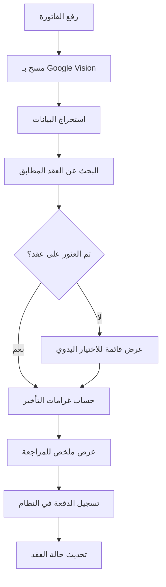

# نظام الفواتير التلقائي - دليل الإعداد والتشغيل

## 📋 نظرة عامة

تم تطوير نظام شامل لإدخال الفواتير تلقائياً يتكون من:

### 🎯 الميزات الرئيسية
- **مسح تلقائي للفواتير** باستخدام Google Vision API
- **مطابقة ذكية للعقود** برقم السيارة أو اسم العميل  
- **حساب تلقائي لغرامات التأخير** حسب النظام الحالي
- **واجهة مستخدم عربية** مع تجربة استخدام سهلة
- **تكامل كامل** مع نظام الدفعات الموجود

---

## 🔧 الملفات المُنشأة

### الخدمات الأساسية
```
src/types/invoice-types.ts          # أنواع البيانات
src/services/invoice-ocr.ts         # خدمة Google Vision OCR
src/services/invoice-matcher.ts     # خدمة المطابقة الذكية
src/utils/invoice-utils.ts          # أدوات المعالجة والحساب
```

### المكونات والواجهات
```
src/hooks/use-invoice-scanner.ts           # React Hooks
src/components/invoices/InvoiceScanner.tsx # مكون المسح الرئيسي
src/components/invoices/InvoiceMatchDialog.tsx # حوار المطابقة
src/pages/InvoiceManagement.tsx            # صفحة إدارة الفواتير
```

### التكامل والاختبار
```
src/utils/invoice-testing.ts        # نظام الاختبار الشامل
INVOICE_SYSTEM_SETUP.md            # هذا الدليل
```

---

## ⚙️ الإعداد المطلوب

### 1. متغيرات البيئة

أضف إلى ملف `.env`:

```env
# Google Vision API (مطلوب للمسح)
VITE_GOOGLE_VISION_API_KEY=your_google_vision_api_key_here

# إعدادات إضافية (اختيارية)
VITE_INVOICE_MAX_FILE_SIZE=10
VITE_INVOICE_MIN_CONFIDENCE=0.6
VITE_INVOICE_AUTO_PROCESS=true
```

### 2. الحصول على Google Vision API Key

1. **إنشاء مشروع في Google Cloud Console:**
   - انتقل إلى [Google Cloud Console](https://console.cloud.google.com)
   - أنشئ مشروع جديد أو استخدم موجود

2. **تفعيل Cloud Vision API:**
   ```bash
   # في Cloud Shell أو محلياً
   gcloud services enable vision.googleapis.com
   ```

3. **إنشاء مفتاح API:**
   - انتقل إلى "APIs & Services" > "Credentials"
   - اضغط "Create Credentials" > "API Key"
   - انسخ المفتاح وضعه في `.env`

4. **تقييد المفتاح (موصى به):**
   - قيد استخدام المفتاح لـ Cloud Vision API فقط
   - قيد النطاقات المسموحة (اختياري)

### 3. التحقق من التبعيات

تأكد من تثبيت الحزم المطلوبة:

```bash
npm install react-dropzone lucide-react
# أو
yarn add react-dropzone lucide-react
```

---

## 🚀 التشغيل والاختبار

### 1. التشغيل الأساسي

```bash
# تشغيل المشروع
npm run dev

# الانتقال إلى صفحة إدارة الفواتير
# http://localhost:3000/invoice-management
```

### 2. الاختبار السريع

افتح وحدة التحكم في المتصفح وقم بتشغيل:

```javascript
// اختبار سريع
await window.invoiceTestUtils.runQuickTest();

// اختبار شامل لجميع المكونات
await window.invoiceTestUtils.runFullTestSuite();

// الحصول على البيانات التجريبية
const mockData = window.invoiceTestUtils.getMockData();
console.log(mockData);
```

### 3. اختبار المسح

1. **انتقل إلى الإجراءات السريعة** في لوحة التحكم
2. **اضغط على "مسح الفواتير"**
3. **ارفع صورة فاتورة تحتوي على:**
   - مبلغ واضح
   - اسم العميل أو رقم السيارة
   - تاريخ

---

## 📱 كيفية الاستخدام

### 1. من الإجراءات السريعة
- في لوحة التحكم، اضغط على **"مسح الفواتير"**
- سيتم توجيهك إلى صفحة إدارة الفواتير

### 2. من القائمة الجانبية
- **الماليات** → **مسح الفواتير**

### 3. عملية المسح
1. **ارفع الفاتورة** (اسحب واترك أو اضغط للاختيار)
2. **انتظر المسح** (2-5 ثواني)
3. **راجع البيانات** المستخرجة
4. **اختر العقد** المناسب (أو اتركه للاختيار التلقائي)
5. **راجع تفاصيل الدفعة** وغرامات التأخير
6. **أكد التسجيل**

---

## 🔄 سير العمل التلقائي



---

## ⚡ نصائح لأفضل النتائج

### 📸 جودة الصورة
- **دقة عالية:** استخدم صوراً بدقة أكثر من 1080p
- **إضاءة جيدة:** تجنب الظلال والانعكاسات
- **وضوح النص:** تأكد من وضوح المبالغ والأسماء

### 📄 أنواع الفواتير المدعومة
- إيصالات إيجار شهرية
- فواتير مخالفات مرورية  
- إيصالات صيانة ووقود
- فواتير PDF أو صور JPG/PNG

### 🎯 نصائح المطابقة
- **تأكد من دقة البيانات:** خاصة أرقام السيارات
- **استخدم أسماء واضحة:** تجنب الاختصارات
- **راجع التواريخ:** للحساب الصحيح لغرامات التأخير

---

## 🔍 استكشاف الأخطاء

### مشاكل شائعة وحلولها

#### ❌ "فشل في مسح الفاتورة"
**الأسباب المحتملة:**
- مفتاح Google Vision API غير صحيح
- حجم الملف كبير جداً (>10MB)
- تنسيق ملف غير مدعوم

**الحلول:**
```bash
# التحقق من متغيرات البيئة
echo $VITE_GOOGLE_VISION_API_KEY

# تصغير حجم الصورة
# استخدم تطبيق ضغط الصور
```

#### ❌ "لم يتم العثور على عقد مطابق"
**الأسباب المحتملة:**
- رقم السيارة غير واضح في الصورة
- اسم العميل مختلف عن السجلات
- العقد غير نشط

**الحلول:**
- استخدم الاختيار اليدوي من القائمة
- تحقق من صحة بيانات العقد
- راجع حالة العقد (نشط/غير نشط)

#### ❌ "خطأ في حساب غرامات التأخير"
**الأسباب المحتملة:**
- تاريخ غير صحيح في الفاتورة
- مشكلة في خوارزمية الحساب

**الحلول:**
- تحقق من تنسيق التاريخ
- راجع إعدادات غرامات التأخير

---

## 📊 المراقبة والإحصائيات

### إحصائيات متاحة
- **معدل نجاح المسح:** نسبة الفواتير الناجحة
- **دقة المطابقة:** نسبة العقود المطابقة صحيحاً
- **متوسط وقت المعالجة:** الوقت من المسح للتسجيل
- **أنواع الفواتير:** توزيع أنواع الفواتير المختلفة

### عرض الإحصائيات
```javascript
// في وحدة التحكم
const stats = await window.invoiceTestUtils.runFullTestSuite();
console.table(stats.results);
```

---

## 🛠️ التخصيص والتطوير

### إضافة أنواع فواتير جديدة

```typescript
// في src/types/invoice-types.ts
export type InvoiceCategory = 
  | 'rent' 
  | 'fuel' 
  | 'maintenance' 
  | 'fine'
  | 'insurance'  // جديد
  | 'other';
```

### تخصيص منطق المطابقة

```typescript
// في src/services/invoice-matcher.ts
// أضف منطق مطابقة مخصص في دالة findMatchingAgreement
```

### إضافة مقدمي OCR آخرين

```typescript
// أنشئ src/services/alternative-ocr.ts
// لإضافة Azure Cognitive Services أو AWS Textract
```

---

## 🔐 الأمان والخصوصية

### حماية البيانات
- **تشفير مفاتيح API:** لا تشارك مفاتيح الـ API
- **تنظيف البيانات:** احذف صور الفواتير بعد المعالجة
- **صلاحيات المستخدمين:** قيد الوصول للمستخدمين المخولين

### أفضل الممارسات
```env
# استخدم متغيرات بيئة منفصلة للإنتاج
VITE_GOOGLE_VISION_API_KEY_PROD=production_key_here
VITE_GOOGLE_VISION_API_KEY_DEV=development_key_here
```

---

## 📞 الدعم والمساعدة

### موارد مفيدة
- [Google Vision API Documentation](https://cloud.google.com/vision/docs)
- [React Dropzone](https://react-dropzone.js.org/)
- [Lucide Icons](https://lucide.dev/)

### نصائح للتطوير
1. **استخدم البيانات التجريبية** للاختبار
2. **فعل الـ console logs** في بيئة التطوير
3. **اختبر سيناريوهات مختلفة** قبل النشر

---

## 🎉 النجاح!

إذا اتبعت هذا الدليل، ستحصل على:

✅ نظام مسح فواتير تلقائي يعمل بكامل طاقته  
✅ مطابقة ذكية للعقود برقم السيارة أو اسم العميل  
✅ حساب تلقائي لغرامات التأخير  
✅ واجهة مستخدم عربية سهلة الاستخدام  
✅ تكامل كامل مع النظام الحالي  

---

**تم إنشاء هذا النظام بواسطة Claude Sonnet 4 🤖**  
*للمساعدة التقنية، راجع ملف `src/utils/invoice-testing.ts` للاختبارات الشاملة* 