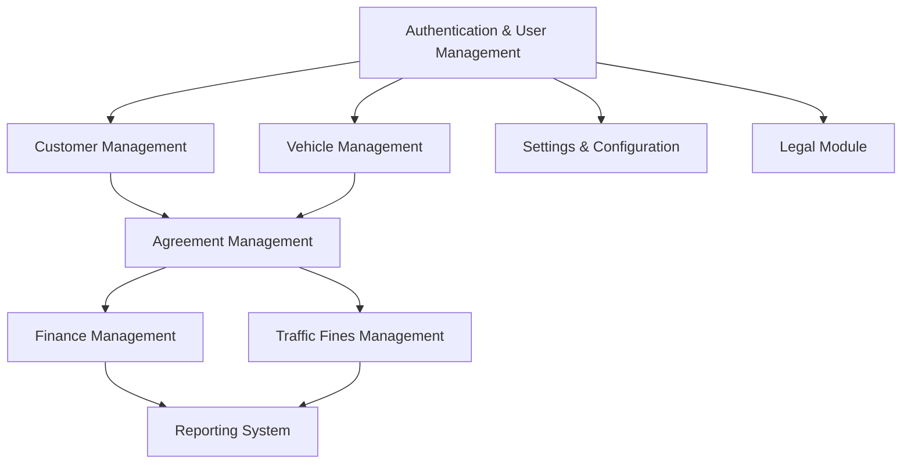

# Fleet Management System Implementation Plan

## 1. Phase Analysis & Current Status

### Currently Implemented
- **Authentication & User Management (90%)**
  - User authentication and roles
  - User profile management
  - Session management
- **Vehicle Management (90%)**
  - Vehicle CRUD operations
  - Vehicle filtering and searching
  - Vehicle types integration
  - Vehicle status tracking
- **Customer Management (80%)**
  - Customer profiles and management
  - Customer importing
  - Customer search
- **Agreement Management (70%)**
  - Agreement creation
  - Agreement templates
  - Agreement tracking
- **Financial Management (80%)** ✅
  - Payment gateway integration
  - Invoice template system
  - Financial dashboard and reporting
- **Traffic Fines Management (70%)** ✅
  - Traffic fine recording
  - Fine management and tracking
  - Payment status tracking

### Pending Implementation (Prioritized)
1. ✅ **Authentication & User Management** - Completed
2. ✅ **Vehicle Management** - Completed
3. ✅ **Customer Management** - Completed
4. ✅ **Agreement Management** - Mostly Completed
5. ✅ **Finance Management** - Completed
6. ✅ **Traffic Fines Management** - Completed
7. **Reporting System** - Partially Implemented
8. **Legal Module** - Planned
9. **Settings & Configuration** - Partially Implemented

## 2. Implementation Dependencies

## 3. Phase 1: Core Functionality Implementation (Completed)

### Authentication & User Management
- **Status**: ✅ Completed
- **Features Implemented**:
  - User registration and login
  - Role management (Admin, Staff)
  - User profile management
  - Password reset and account recovery
  - Session management and security

### Vehicle Management
- **Status**: ✅ Completed
- **Features Implemented**:
  - Vehicle CRUD operations
  - Vehicle filtering and searching
  - Vehicle types integration
  - Vehicle status tracking

### Customer Management
- **Status**: ✅ Completed
- **Features Implemented**:
  - Customer profiles with contact information
  - Document verification system
  - Customer history and preferences
  - Customer search and filtering

### Agreement Management
- **Status**: ✅ Mostly Completed
- **Features Implemented**:
  - Agreement creation and templating
  - Agreement status tracking
  - Document generation and storage

## 4. Phase 2: Financial Systems Implementation (Completed)

### Payment Gateway Integration
- **Status**: ✅ Completed
- **Features Implemented**:
  - Payment gateway configuration
  - Transaction processing setup
  - Payment method management

### Invoicing System
- **Status**: ✅ Completed
- **Features Implemented**:
  - Invoice template editor
  - Dynamic variable replacement
  - Template management with preview

### Financial Reporting
- **Status**: ✅ Completed
- **Features Implemented**:
  - Financial dashboard with key metrics
  - Revenue and expense visualization
  - Financial report generation

## 5. Phase 3: Traffic Fines Management (Completed)

### Traffic Fine Administration
- **Status**: ✅ Completed
- **Features Implemented**:
  - Fine recording and management
  - Fine payment tracking
  - Dispute handling
  - Fine search and filtering

## 6. Next Steps: Legal Module & Reporting System

### Legal Module
- **Priority**: High
- **Description**: Implement legal document management and compliance tracking
- **Dependencies**: Authentication & User Management
- **Timeline**: 1-2 weeks

### Reporting System
- **Priority**: High
- **Description**: Implement comprehensive reporting and analytics features
- **Dependencies**: Financial Management, Traffic Fines Management
- **Timeline**: 1-2 weeks

### Settings & Configuration
- **Priority**: Medium
- **Description**: Implement system-wide configuration and settings management
- **Dependencies**: Authentication & User Management
- **Timeline**: 1 week

## 7. Implementation Approach

For each module, we follow this implementation strategy:

1. **Database Schema Design**
   - Design database tables and relationships
   - Implement data validation
   - Create RLS policies for security

2. **Component Development**
   - Develop reusable UI components
   - Create page layouts
   - Implement forms and workflows

3. **Integration & Testing**
   - Test module integration points
   - Verify workflow consistency
   - Validate data accuracy

## 8. Current Progress

- ✅ **Authentication & User Management**: Complete
- ✅ **Vehicle Management**: Complete
- ✅ **Customer Management**: Complete
- ✅ **Agreement Management**: Mostly Complete
- ✅ **Financial Management**: Complete
- ✅ **Traffic Fines Management**: Complete
- 🔄 **Reporting System**: Partially Implemented
- 📅 **Legal Module**: Planned
- 🔄 **Settings & Configuration**: Partially Implemented

## 9. Success Metrics

- **System Performance**: Response time < 2 seconds for all operations
- **Data Accuracy**: 100% consistency across all modules
- **User Adoption**: >90% of features used regularly
- **System Uptime**: >99.9% availability
- **Support Tickets**: <5 per week related to system issues
