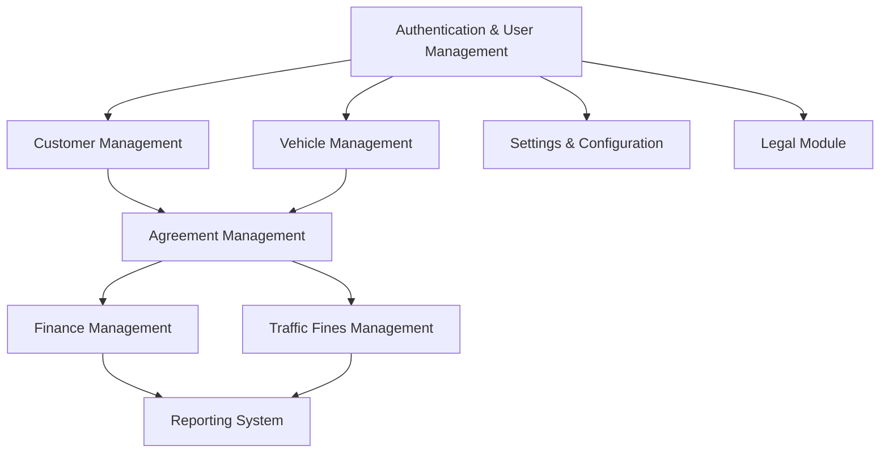

# Fleet Management System Implementation Plan

## 1. Phase Analysis & Current Status

### Currently Implemented
- **Vehicle Management (70%)**
  - Vehicle CRUD operations
  - Vehicle filtering and searching
  - Vehicle types integration
  - Vehicle status tracking

### Pending Implementation (Prioritized)
1. **Authentication & User Management**
2. **Customer Management**
3. **Agreement Management**
4. **Finance Management**
5. **Traffic Fines Management**
6. **Reporting System**
7. **Legal Module**
8. **Settings & Configuration**

## 2. Implementation Dependencies

## 3. Phase 1: Core Functionality Implementation

### Authentication & User Management
- **Priority**: High (1)
- **Description**: Implement user authentication, role-based access control, and user profile management
- **Dependencies**: None
- **Timeline**: 1-2 weeks

#### Features
- User registration and login
- Role management (Admin, Manager, Agent, Driver)
- User profile management
- Password reset and account recovery
- Session management and security

#### Technical Implementation
- Leverage Supabase Auth
- Create user tables with proper relationships
- Implement role-based policies
- Develop authentication UI components

### Customer Management
- **Priority**: High (2)
- **Description**: Implement customer profile management, history tracking, and verification
- **Dependencies**: Authentication & User Management
- **Timeline**: 1-2 weeks

#### Features
- Customer profiles with contact information
- Document verification system
- Customer history and preferences
- Corporate accounts and individual profiles
- Search and filtering

#### Technical Implementation
- Create customer database schema
- Implement document upload and verification
- Develop customer history tracking
- Build customer UI components

### Agreement Management
- **Priority**: High (3)
- **Description**: Implement rental agreement creation, management, and tracking
- **Dependencies**: Customer Management, Vehicle Management
- **Timeline**: 2-3 weeks

#### Features
- Agreement creation and templating
- Digital signature integration
- Agreement status tracking
- Renewal and extension workflows
- Document generation and storage

#### Technical Implementation
- Create agreement database schema
- Implement document generation system
- Develop digital signature integration
- Build agreement UI components

## 4. Phase 2: Financial & Compliance Implementation

### Finance Management
- **Priority**: Medium (4)
- **Description**: Implement payment processing, invoicing, and financial reporting
- **Dependencies**: Agreement Management
- **Timeline**: 2-3 weeks

#### Features
- Payment processing integration
- Invoice generation and management
- Financial reporting and analytics
- Expense tracking and reconciliation

#### Technical Implementation
- Create finance database schema
- Implement payment gateway integration
- Develop invoice generation system
- Build financial UI components

### Traffic Fines Management
- **Priority**: Medium (5)
- **Description**: Implement traffic fine tracking, payment, and reporting
- **Dependencies**: Agreement Management
- **Timeline**: 1-2 weeks

#### Features
- Fine registration and tracking
- Payment processing for fines
- Reporting and analytics
- Customer notification system

#### Technical Implementation
- Create fines database schema
- Implement fine tracking system
- Develop payment integration
- Build fine management UI components

## 5. Phase 3: Analytics & Compliance Implementation

### Reporting System
- **Priority**: Medium (6)
- **Description**: Implement comprehensive reporting and analytics features
- **Dependencies**: Finance Management, Traffic Fines Management
- **Timeline**: 2-3 weeks

#### Features
- Financial reports
- Operational reports
- Custom report generation
- Data visualization
- Export capabilities

#### Technical Implementation
- Create reporting data warehouse
- Implement data aggregation system
- Develop chart and graph visualizations
- Build reporting UI components

### Legal Module
- **Priority**: Low (7)
- **Description**: Implement legal document management and compliance tracking
- **Dependencies**: Authentication & User Management
- **Timeline**: 1-2 weeks

#### Features
- Legal document templates
- Compliance tracking and reporting
- Legal case management
- Document generation and storage

#### Technical Implementation
- Create legal database schema
- Implement document generation system
- Develop compliance tracking
- Build legal UI components

### Settings & Configuration
- **Priority**: Low (8)
- **Description**: Implement system-wide configuration and settings management
- **Dependencies**: Authentication & User Management
- **Timeline**: 1 week

#### Features
- System configuration
- User preferences
- Notification settings
- Integration configurations

#### Technical Implementation
- Create settings database schema
- Implement configuration management system
- Develop settings UI components

## 6. Implementation Approach

For each module, we'll follow this implementation strategy:

1. **Database Schema Design**
   - Design database tables and relationships
   - Implement data validation
   - Create RLS policies for security

2. **API Development**
   - Create CRUD operations for each entity
   - Implement business logic
   - Add validation and error handling

3. **UI Component Development**
   - Develop reusable UI components
   - Create page layouts
   - Implement forms and workflows

4. **Integration Testing**
   - Test module integration points
   - Verify workflow consistency
   - Validate data accuracy

5. **User Acceptance Testing**
   - Validate against user requirements
   - Collect feedback
   - Make necessary adjustments

## 7. Next Steps: Authentication & User Management Implementation

Next immediate steps:

1. Design user roles and permissions
2. Create database schema for users and roles
3. Implement Supabase Auth integration
4. Develop UI components for auth flows
5. Add role-based access control to existing vehicle management

## 8. Risk Management

| Risk | Impact | Mitigation |
|------|--------|------------|
| Integration complexity between modules | High | Implement clear interfaces and thorough testing |
| Data consistency across modules | High | Use database constraints and validation |
| Performance issues with growing data | Medium | Design for scalability and implement caching |
| Security vulnerabilities | High | Implement proper authentication and authorization |
| User adoption challenges | Medium | Focus on UX and provide comprehensive documentation |

## 9. Success Metrics

- **System Performance**: Response time < 2 seconds for all operations
- **Data Accuracy**: 100% consistency across all modules
- **User Adoption**: >90% of features used regularly
- **System Uptime**: >99.9% availability
- **Support Tickets**: <5 per week related to system issues
