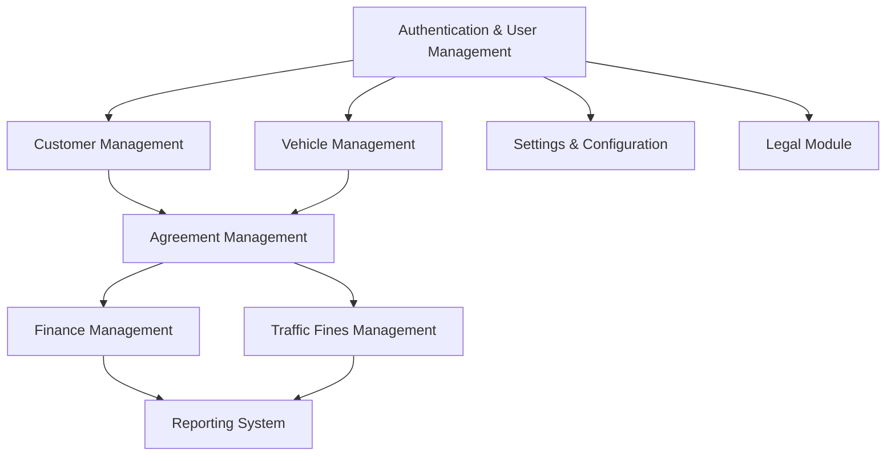

# Fleet Management System - Implementation Plan

## Current Implementation Status

| Module | Status | Completion |
|--------|--------|------------|
| Authentication & User Management | Implemented | 90% |
| Vehicle Management | Implemented | 90% |
| Customer Management | Implemented | 80% |
| Agreement Management | Implemented | 70% |
| Finance Management | Partially Implemented | 50% |
| Traffic Fines Management | Partially Implemented | 40% |
| Reporting System | Partially Implemented | 30% |
| Legal Module | Planned | 10% |
| Settings & Configuration | Partially Implemented | 20% |

## Implementation Dependencies

## Phase 1: Core Systems (Completed)

### Authentication & User Management
- **Status**: ✅ Implemented
- **Features**:
  - Role-based access control (Admin, Staff)
  - User profile management
  - Password reset functionality
  - Session management and security

### Vehicle Management
- **Status**: ✅ Implemented
- **Features**:
  - Vehicle CRUD operations
  - Status tracking (available, rented, maintenance)
  - Vehicle details and history

### Customer Management
- **Status**: ✅ Implemented
- **Features**:
  - Customer profiles and contact information
  - Document verification system
  - Customer history tracking

### Agreement Management
- **Status**: ✅ Mostly Implemented
- **Features**:
  - Agreement creation and templates
  - Agreement status tracking
  - Document generation

## Phase 2: Financial Systems Enhancement (In Progress)

### Payment Gateway Integration
- **Objective**: Implement secure payment processing
- **Tasks**:
  - Integrate with payment gateway provider
  - Implement payment tokenization for PCI compliance
  - Create webhook handlers for payment events
  - Develop payment reconciliation system

### Invoicing System Upgrade
- **Objective**: Enhance invoice generation and management
- **Tasks**:
  - Create customizable invoice templates
  - Implement automatic invoice scheduling
  - Develop invoice tracking and reminder system
  - Add support for partial payments and payment plans

### Financial Reporting
- **Objective**: Provide comprehensive financial insights
- **Tasks**:
  - Develop revenue projection models
  - Create cash flow analysis dashboards
  - Implement expense tracking and categorization
  - Add tax calculation and reporting features

## Phase 3: Traffic Fines & Legal Management (Planned)

### Traffic Fine Administration
- **Objective**: Streamline traffic fine management
- **Tasks**:
  - Implement fine assignment workflow with verification
  - Create dispute management system
  - Develop payment tracking for fines
  - Add reporting for fine trends and hotspots

### Legal Document Management
- **Objective**: Enhance legal document handling
- **Tasks**:
  - Create document template system with variables
  - Implement document generation and versioning
  - Add electronic signature capability
  - Develop document storage and retrieval system

### Compliance Tracking
- **Objective**: Ensure regulatory compliance
- **Tasks**:
  - Implement compliance checklist by jurisdiction
  - Create automated compliance verification
  - Develop compliance reporting
  - Add notification system for compliance deadlines

## Phase 4: System Configuration & Integration (Planned)

### System-wide Configuration
- **Objective**: Create flexible system configuration
- **Tasks**:
  - Implement company profile settings
  - Create role and permission management
  - Develop system behavior configuration
  - Add localization and internationalization support

### User Preferences & UI Enhancement
- **Objective**: Improve user experience and personalization
- **Tasks**:
  - Implement user preference storage
  - Create theme and layout customization
  - Add dashboard widget configuration
  - Develop shortcuts and quick access features

### Notification System
- **Objective**: Enhance communication and alerts
- **Tasks**:
  - Implement multi-channel notifications (email, SMS, in-app)
  - Create notification preferences and subscriptions
  - Develop notification templates with variables
  - Add notification scheduling and batching

## Phase 5: Integration & Advanced Features (Planned)

### External API Integration
- **Objective**: Connect with external services
- **Tasks**:
  - Implement GPS and location tracking integration
  - Create maintenance service provider connections
  - Develop traffic authority data exchange
  - Add insurance provider integration

### Advanced Analytics
- **Objective**: Provide deeper business insights
- **Tasks**:
  - Implement predictive maintenance models
  - Create customer behavior analysis
  - Develop revenue optimization suggestions
  - Add anomaly detection for fraud prevention

### System Performance Optimization
- **Objective**: Ensure system scalability and performance
- **Tasks**:
  - Implement query optimization and caching
  - Create database indexing strategy
  - Develop resource usage monitoring
  - Add load balancing and scaling configuration

### Mobile Responsiveness
- **Objective**: Ensure full functionality on mobile devices
- **Tasks**:
  - Optimize all UI components for mobile
  - Implement touch-friendly interactions
  - Create mobile-specific workflows for field operations
  - Add offline functionality for critical operations

## Risk Management

| Risk | Impact | Probability | Mitigation |
|------|--------|------------|------------|
| Data migration issues | High | Medium | Create comprehensive data validation, implement rollback capability |
| Payment integration failures | High | Medium | Thorough testing, fallback payment methods, manual override capability |
| Performance bottlenecks | Medium | High | Performance testing at each phase, monitoring, early optimization |
| User adoption challenges | Medium | Medium | Intuitive UI design, comprehensive training, feedback mechanism |
| Compliance gaps | High | Low | Regular compliance audits, expert consultation, automated compliance checks |

## Current Progress

- ✅ Authentication & User Management: Complete
- ✅ Vehicle Management: Complete
- ✅ Customer Management: Complete
- ✅ Agreement Management: Mostly Complete
- 🔄 Financial Management: In Progress
- 🔄 Traffic Fines Management: Partially Implemented
- 🔄 Reporting System: Partially Implemented
- 📅 Legal Module: Planned
- 🔄 Settings & Configuration: Partially Implemented

## Next Steps

1. Complete Financial System enhancements
2. Enhance Traffic Fines Management
3. Improve Reporting capabilities
4. Implement Legal Module
5. Finalize System Configuration options

## Technical Stack

- **Frontend**: React, TypeScript, Tailwind CSS, ShadCN UI
- **State Management**: React Query, Context API
- **Backend**: Supabase (PostgreSQL, Auth, Storage, Functions)
- **Deployment**: Containerized with automatic scaling
- **Monitoring**: Error tracking, performance monitoring
- **Security**: Role-based access control, encryption, audit logging
