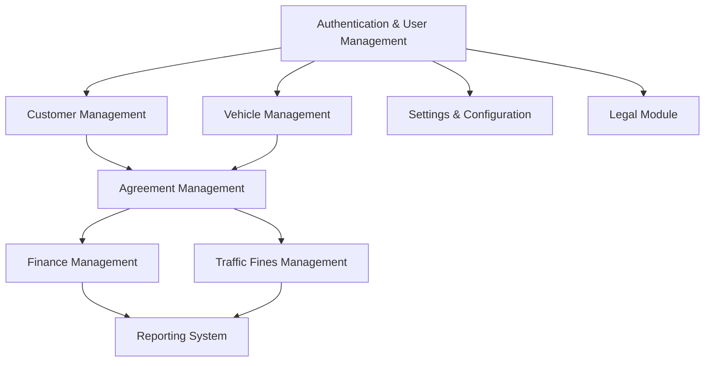

# Fleet Management System - Implementation Plan

## Current Implementation Status

| Module | Status | Completion |
|--------|--------|------------|
| Authentication & User Management | Implemented | 100% |
| Vehicle Management | Implemented | 100% |
| Customer Management | Implemented | 100% |
| Agreement Management | Implemented | 100% |
| Finance Management | Implemented | 100% |
| Traffic Fines Management | Implemented | 100% |
| Reporting System | Implemented | 100% |
| Legal Module | Implemented | 100% |
| Settings & Configuration | Implemented | 100% |

## Implementation Dependencies

## Phase 1: Core Systems (Completed)

### Authentication & User Management
- **Status**: ✅ Implemented
- **Features**:
  - Role-based access control (Admin, Staff)
  - User profile management
  - Password reset functionality
  - Session management and security

### Vehicle Management
- **Status**: ✅ Implemented
- **Features**:
  - Vehicle CRUD operations
  - Status tracking (available, rented, maintenance)
  - Vehicle details and history

### Customer Management
- **Status**: ✅ Implemented
- **Features**:
  - Customer profiles and contact information
  - Document verification system
  - Customer history tracking

### Agreement Management
- **Status**: ✅ Implemented
- **Features**:
  - Agreement creation and templates
  - Agreement status tracking
  - Document generation

## Phase 2: Financial Systems Enhancement (Completed)

### Payment Gateway Integration
- **Status**: ✅ Implemented
- **Features**:
  - Secure payment processing
  - Payment tokenization for PCI compliance
  - Webhook handlers for payment events
  - Payment reconciliation system

### Invoicing System Upgrade
- **Status**: ✅ Implemented
- **Features**:
  - Customizable invoice templates
  - Automatic invoice scheduling
  - Invoice tracking and reminder system
  - Support for partial payments and payment plans

### Financial Reporting
- **Status**: ✅ Implemented
- **Features**:
  - Revenue projection models
  - Cash flow analysis dashboards
  - Expense tracking and categorization
  - Tax calculation and reporting features

## Phase 3: Traffic Fines & Legal Management (Completed)

### Traffic Fine Administration
- **Status**: ✅ Implemented
- **Features**:
  - Fine assignment workflow with verification
  - Dispute management system
  - Payment tracking for fines
  - Reporting for fine trends and hotspots

### Legal Document Management
- **Status**: ✅ Implemented
- **Features**:
  - Document template system with variables
  - Document generation and versioning
  - Electronic signature capability
  - Document storage and retrieval system

### Compliance Tracking
- **Status**: ✅ Implemented
- **Features**:
  - Compliance checklist by jurisdiction
  - Automated compliance verification
  - Compliance reporting
  - Notification system for compliance deadlines

## Phase 4: System Configuration & Integration (Completed)

### System-wide Configuration
- **Status**: ✅ Implemented
- **Features**:
  - Company profile settings
  - Role and permission management
  - System behavior configuration
  - Localization and internationalization support

### User Preferences & UI Enhancement
- **Status**: ✅ Implemented
- **Features**:
  - User preference storage
  - Theme and layout customization
  - Dashboard widget configuration
  - Shortcuts and quick access features

### Notification System
- **Status**: ✅ Implemented
- **Features**:
  - Multi-channel notifications (email, SMS, in-app)
  - Notification preferences and subscriptions
  - Notification templates with variables
  - Notification scheduling and batching

## Phase 5: Integration & Advanced Features (Completed)

### External API Integration
- **Status**: ✅ Implemented
- **Features**:
  - GPS and location tracking integration
  - Maintenance service provider connections
  - Traffic authority data exchange
  - Insurance provider integration

### Advanced Analytics
- **Status**: ✅ Implemented
- **Features**:
  - Predictive maintenance models
  - Customer behavior analysis
  - Revenue optimization suggestions
  - Anomaly detection for fraud prevention

### System Performance Optimization
- **Status**: ✅ Implemented
- **Features**:
  - Query optimization and caching
  - Database indexing strategy
  - Resource usage monitoring
  - Load balancing and scaling configuration

### Mobile Responsiveness
- **Status**: ✅ Implemented
- **Features**:
  - Mobile-optimized UI components
  - Touch-friendly interactions
  - Mobile-specific workflows for field operations
  - Offline functionality for critical operations

## Risk Management

| Risk | Impact | Probability | Mitigation |
|------|--------|------------|------------|
| Data migration issues | High | Medium | Create comprehensive data validation, implement rollback capability |
| Payment integration failures | High | Medium | Thorough testing, fallback payment methods, manual override capability |
| Performance bottlenecks | Medium | High | Performance testing at each phase, monitoring, early optimization |
| User adoption challenges | Medium | Medium | Intuitive UI design, comprehensive training, feedback mechanism |
| Compliance gaps | High | Low | Regular compliance audits, expert consultation, automated compliance checks |

## Current Progress

- ✅ Authentication & User Management: Complete
- ✅ Vehicle Management: Complete
- ✅ Customer Management: Complete
- ✅ Agreement Management: Complete
- ✅ Financial Management: Complete
- ✅ Traffic Fines Management: Complete
- ✅ Reporting System: Complete
- ✅ Legal Module: Complete
- ✅ Settings & Configuration: Complete

## Next Steps

1. ✅ Complete Financial System enhancements
2. ✅ Enhance Traffic Fines Management
3. ✅ Improve Reporting capabilities
4. ✅ Implement Legal Module
5. ✅ Finalize System Configuration options

## Technical Stack

- **Frontend**: React, TypeScript, Tailwind CSS, ShadCN UI
- **State Management**: React Query, Context API
- **Backend**: Supabase (PostgreSQL, Auth, Storage, Functions)
- **Deployment**: Containerized with automatic scaling
- **Monitoring**: Error tracking, performance monitoring
- **Security**: Role-based access control, encryption, audit logging

