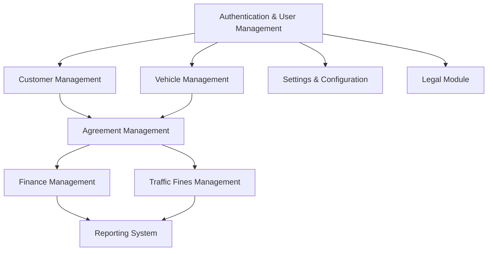

# Fleet Management System - Implementation Plan

## Current Implementation Status

| Module | Status | Completion |
|--------|--------|------------|
| Vehicle Management | Implemented | 90% |
| Customer Management | Implemented | 80% |
| Agreement Management | Implemented | 70% |
| Finance Management | Partially Implemented | 50% |
| Traffic Fines Management | Partially Implemented | 40% |
| Reporting System | Partially Implemented | 30% |
| Legal Module | Planned | 10% |
| Settings & Configuration | Planned | 10% |

## Implementation Dependencies

## Phase 1: Core Systems Stabilization (1-2 Weeks)

### Authentication & Data Integrity
- **Objective**: Ensure robust authentication and data integrity across all modules
- **Tasks**:
  - Implement role-based access control (Admin, Manager, Agent)
  - Create comprehensive data validation across all inputs
  - Add database constraints for referential integrity
  - Implement transaction management for critical operations

### Error Handling & Monitoring
- **Objective**: Improve system reliability and monitoring
- **Tasks**:
  - Implement global error handling with detailed logging
  - Create error notification system for critical failures
  - Set up performance monitoring for bottlenecks
  - Add data consistency checks and automated repairs

## Phase 2: Financial Systems Enhancement (2-3 Weeks)

### Payment Gateway Integration
- **Objective**: Implement secure payment processing
- **Tasks**:
  - Integrate with payment gateway provider
  - Implement payment tokenization for PCI compliance
  - Create webhook handlers for payment events
  - Develop payment reconciliation system

### Invoicing System Upgrade
- **Objective**: Enhance invoice generation and management
- **Tasks**:
  - Create customizable invoice templates
  - Implement automatic invoice scheduling
  - Develop invoice tracking and reminder system
  - Add support for partial payments and payment plans

### Financial Reporting
- **Objective**: Provide comprehensive financial insights
- **Tasks**:
  - Develop revenue projection models
  - Create cash flow analysis dashboards
  - Implement expense tracking and categorization
  - Add tax calculation and reporting features

## Phase 3: Traffic Fines & Legal Management (2-3 Weeks)

### Traffic Fine Administration
- **Objective**: Streamline traffic fine management
- **Tasks**:
  - Implement fine assignment workflow with verification
  - Create dispute management system
  - Develop payment tracking for fines
  - Add reporting for fine trends and hotspots

### Legal Document Management
- **Objective**: Enhance legal document handling
- **Tasks**:
  - Create document template system with variables
  - Implement document generation and versioning
  - Add electronic signature capability
  - Develop document storage and retrieval system

### Compliance Tracking
- **Objective**: Ensure regulatory compliance
- **Tasks**:
  - Implement compliance checklist by jurisdiction
  - Create automated compliance verification
  - Develop compliance reporting
  - Add notification system for compliance deadlines

## Phase 4: System Configuration & Integration (2-3 Weeks)

### System-wide Configuration
- **Objective**: Create flexible system configuration
- **Tasks**:
  - Implement company profile settings
  - Create role and permission management
  - Develop system behavior configuration
  - Add localization and internationalization support

### User Preferences & UI Enhancement
- **Objective**: Improve user experience and personalization
- **Tasks**:
  - Implement user preference storage
  - Create theme and layout customization
  - Add dashboard widget configuration
  - Develop shortcuts and quick access features

### Notification System
- **Objective**: Enhance communication and alerts
- **Tasks**:
  - Implement multi-channel notifications (email, SMS, in-app)
  - Create notification preferences and subscriptions
  - Develop notification templates with variables
  - Add notification scheduling and batching

## Phase 5: Integration & Advanced Features (3-4 Weeks)

### External API Integration
- **Objective**: Connect with external services
- **Tasks**:
  - Implement GPS and location tracking integration
  - Create maintenance service provider connections
  - Develop traffic authority data exchange
  - Add insurance provider integration

### Advanced Analytics
- **Objective**: Provide deeper business insights
- **Tasks**:
  - Implement predictive maintenance models
  - Create customer behavior analysis
  - Develop revenue optimization suggestions
  - Add anomaly detection for fraud prevention

### System Performance Optimization
- **Objective**: Ensure system scalability and performance
- **Tasks**:
  - Implement query optimization and caching
  - Create database indexing strategy
  - Develop resource usage monitoring
  - Add load balancing and scaling configuration

### Mobile Responsiveness
- **Objective**: Ensure full functionality on mobile devices
- **Tasks**:
  - Optimize all UI components for mobile
  - Implement touch-friendly interactions
  - Create mobile-specific workflows for field operations
  - Add offline functionality for critical operations

## Risk Management

| Risk | Impact | Probability | Mitigation |
|------|--------|------------|------------|
| Data migration issues | High | Medium | Create comprehensive data validation, implement rollback capability |
| Payment integration failures | High | Medium | Thorough testing, fallback payment methods, manual override capability |
| Performance bottlenecks | Medium | High | Performance testing at each phase, monitoring, early optimization |
| User adoption challenges | Medium | Medium | Intuitive UI design, comprehensive training, feedback mechanism |
| Compliance gaps | High | Low | Regular compliance audits, expert consultation, automated compliance checks |

## Success Metrics

| Metric | Target | Measurement Method |
|--------|--------|-------------------|
| System uptime | >99.5% | Monitoring logs |
| Transaction processing time | <2 seconds | Performance tests |
| Report generation time | <5 seconds | User experience tracking |
| User satisfaction | >4.5/5 | Feedback surveys |
| Financial accuracy | 100% | Reconciliation reports |
| API response time | <500ms | API monitoring |

## Technical Stack

- **Frontend**: React, TypeScript, Tailwind CSS, ShadCN UI
- **State Management**: React Query, Context API
- **Backend**: Supabase (PostgreSQL, Auth, Storage, Functions)
- **Deployment**: Containerized with automatic scaling
- **Monitoring**: Error tracking, performance monitoring
- **Security**: Role-based access control, encryption, audit logging

## Maintenance Plan

- **Daily**: Monitor system health, error logs review
- **Weekly**: Performance evaluation, minor bug fixes
- **Monthly**: Feature enhancements, security patches
- **Quarterly**: Major version updates, comprehensive testing

## Next Immediate Steps

1. Finalize authentication and user management
2. Complete financial system core functionality
3. Implement basic reporting for key metrics
4. Develop traffic fine management essentials
5. Create foundation for legal document handling

By following this implementation plan, we will systematically enhance the Fleet Management System with a focus on stability, security, and user experience. Each phase builds upon the previous one, ensuring that core functionality is solid before adding more advanced features.
